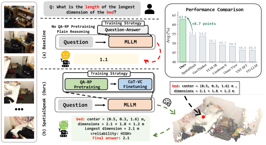
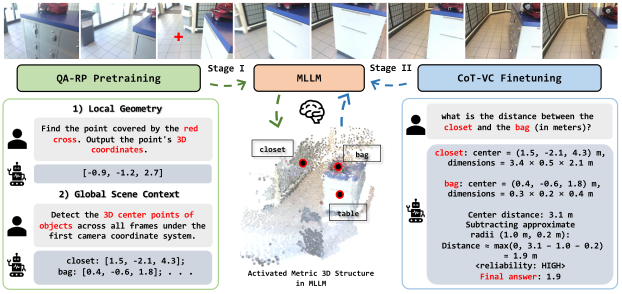
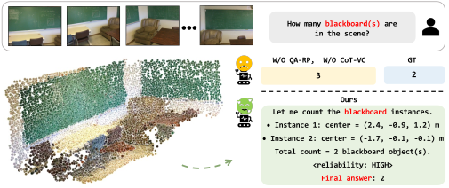

# 🤖 SpatialSpeak: QA-Native Reconstruction with Local and Global Context for Spatial Chain-of-Thought Reasoning

⭐ If you find SpatialSpeak interesting, please consider starring this repository. Thank you!

> [Yang Cao](https://yangcaoai.github.io/)<sup>1</sup>, [Jiaxin Zhang](https://zestfuljx.github.io/)<sup>3</sup>, [Dave Zhenyu Chen](https://daveredrum.github.io/)<sup>2</sup>, [Yingji Zhong](https://zhongyingji.github.io/)<sup>1</sup>, [Ruiyuan Gao](https://gaoruiyuan.com/)<sup>2</sup>, [Lanqing Hong](https://racheltechie.github.io/)<sup>2</sup>, [Dan Xu*](https://www.danxurgb.net/)<sup>1</sup>
>
> <sup>1</sup> The Hong Kong University of Science and Technology  
> <sup>2</sup> Huawei Noah’s Ark Lab  
> <sup>3</sup> Harbin Institute of Technology

**[📄 Paper](https://arxiv.org/pdf/2609.33616) · [🌐 Project Page](https://yangcaoai.github.io/SpatialSpeak/)**

## 🚩 Updates

- Our paper is now available on [arXiv](https://arxiv.org/pdf/2609.33616).

- The code has not yet been released. Please stay tuned for updates.

## Motivation

**Learning local geometry and global context makes spatial CoT more effective.**

<p align="center">
  
</p>

On ReVSI, reconstruction pretraining increases the gain from spatial CoT learning from **2.6 to 6.9 points**. SpatialSpeak-4B achieves **62.8**, exceeding the strongest compared baseline by **8.7 points**.

## Framework

A two-stage framework that connects reconstruction and reasoning through a shared text-based question-answering interface:

<p align="center">
  
</p>

## Visualization of Spatial Reasoning


<p align="center">
  
</p>

Visit our [project page](https://yangcaoai.github.io/SpatialSpeak/) for the demo video, interactive point clouds, and additional examples.

## 📜 BibTeX

If you find SpatialSpeak useful for your research, please consider citing:

```bibtex
@article{cao2026spatialspeak,
  title={SpatialSpeak: QA-Native Reconstruction with Local and Global Context for Spatial Chain-of-Thought Reasoning},
  author={Cao, Yang and Zhang, Jiaxin and Chen, Dave Zhenyu and Zhong, Yingji and Gao, Ruiyuan and Hong, Lanqing and Xu, Dan},
  journal={arXiv preprint arXiv:2609.33616},
  year={2026}
}
```

## 📧 Contact

For questions, please contact [Yang Cao](mailto:yangcao.cs@gmail.com).

## 📜 Sincere Acknowledgement

We sincerely thank the authors of the following projects for sharing their research and resources with the community:

[GeoThinker](https://github.com/Li-Hao-yuan/GeoThinker), [SpatialStack](https://github.com/jzh15/SpatialStack), [VG-LLM](https://github.com/LaVi-Lab/VG-LLM), [VLM-3R](https://github.com/vita-group/vlm-3r), [Qwen3-VL](https://github.com/QwenLM/Qwen3-VL), [ReVSI](https://github.com/3dlg-hcvc/revsi), [VSI-Bench](https://github.com/vision-x-nyu/thinking-in-space), [SPAR](https://github.com/LogosRoboticsGroup/SPAR), [Cambrian-S](https://github.com/cambrian-mllm/cambrian-s), etc
